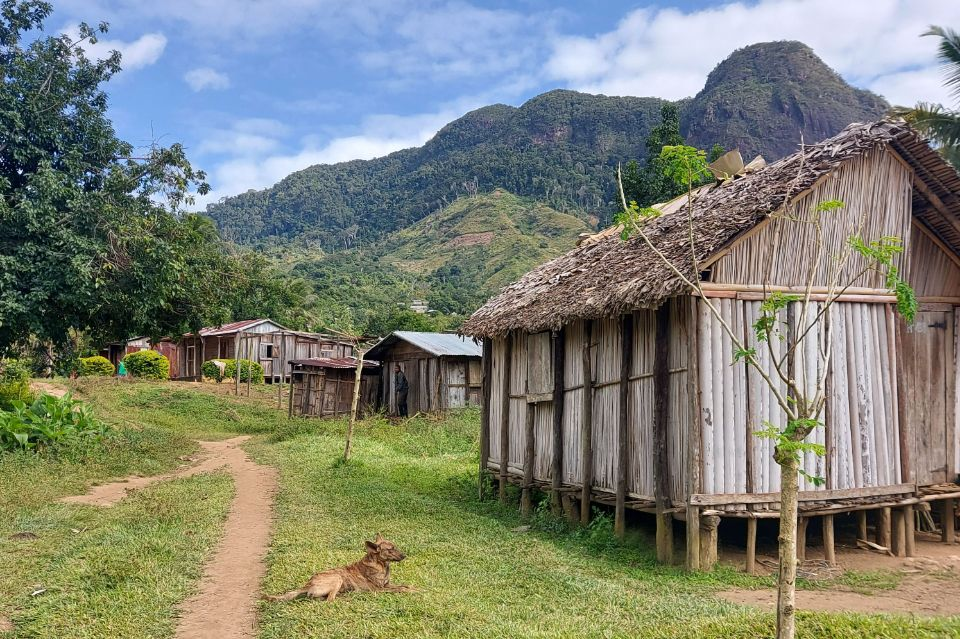
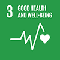
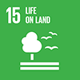
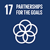

{fig-align="center"}

## Kayla Kauffman

| (she/her)
| PhD Candidate
| Ecology, Evolution, and Marine Biology
| University of California, Santa Barbara
| [Young Lab](https://young-lab.eemb.ucsb.edu/)

## Research Interests

Community Ecology ⚬ Disease Ecology ⚬ One Health

My passion lies in the intersection of wildlife, domestic animal, and human health, particularly in the context of zoonotic diseases. Fueled by experiences in animal agriculture, wildlife disease research, and travel to regions facing deforestation and zoonotic threats, I'm dedicated to becoming a leader in the field of [One Health](https://www.onehealthcommission.org/en/why_one_health/what_is_one_health/).

My Ph.D. research focuses on pathogens found at the human-animal interface in the area surrounding [Marojejy National Park](https://en.wikipedia.org/wiki/Marojejy_National_Park) in northeastern Madagascar. I used a combination of approaches -- building transmission potential networks, testing interventions such as dog vaccinations, and employing theoretical models -- to understand multi-host disease dynamics and design effective prevention strategies.

Currently, my work builds on this foundation by using a combination of theoretical approaches and empirical analyses to address two key questions:

1.  **The utility of building parasite exposure risk maps for predicting human infections**: Can we create maps that predict where people are most likely to encounter zoonotic parasites, aiding in targeted public health interventions?\
2.  **The efficacy of vaccinating a reservoir host to control multi-host species pathogens**: How effective is vaccinating animal species that harbor zoonotic diseases (reservoir hosts) in controlling their spread to other species, including humans?

Ultimately, I believe in bridging the gap between theory and practice in disease control. By combining real-world data with theoretical frameworks, I aim to develop solutions that address neglected tropical diseases and emerging zoonotic threats, promoting healthy ecosystems and human well-being.

## Expertise related to UN Sustainable Development Goals

The [Sustainable Development Goals](https://sdgs.un.org/goals) aim to end poverty, protect the planet, and ensure prosperity for all. My work contributes towards the following goals:

::: {layout-ncol="3"}

:::
