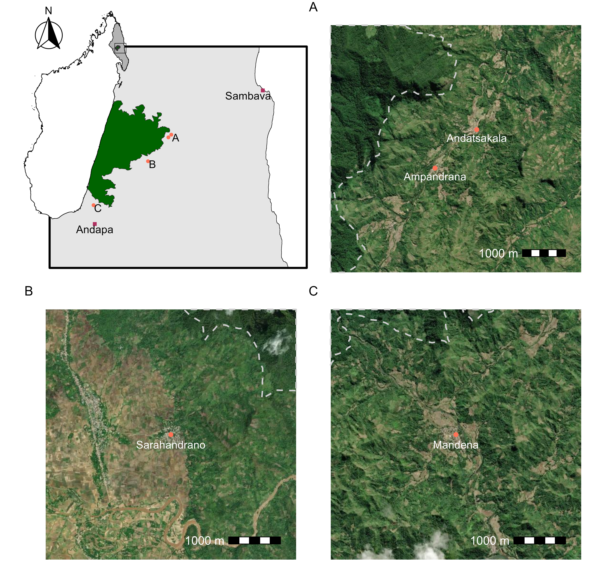

```{r}
#| echo: false
#| message: false

library(tidyverse)
library(patchwork)
library(sf)
library(ggspatial)
library(basemaps)
```

## Introduction

Building maps of a study area using R is straight forward, flexible, and easily adaptable. For this example I am going to make a map of the region where my PhD research takes place in the SAVA region of Madagascar. Maps like these are in my [Astrovirus](publications.qmd#section-1) paper and [Leptospira in small mammals](publications.qmd) paper.

## Data set up

The data needed to build these maps is just the locations of each of the villages and a shapefile of the boundary of Marojejy National Park. The shapefile is publicly available from [Protected Planet](https://www.protectedplanet.net/2305). The `geodata` package has country and regional boarders. To work with spatial data the `sf` package is needed.

```{r}
## coord reference desired (this matches the basemaps)
crs_desired <- 3857

## Village locations
village_locs <- data.frame(
  ## regional notes if this is a major city in the region
  regional = c(0, 0, 0, 0, 1, 1),
  village = c("Andatsakala", "Ampandrana", "Mandena", "Sarahandrano",
              "Sambava", "Andapa"),
  lat = c(-14.39810, -14.40613, -14.47705, -14.60757,
          -14.26652, -14.66350),
  lon = c(49.88619, 49.87721, 49.81470, 49.64776,
          50.16664, 49.65145)
) %>% 
  mutate(regional = as.factor(regional)) %>% 
  ## make spatial (currently WGS 84)
  st_as_sf(coords = c("lon", "lat"), crs=4326) %>% 
  ## re project
  st_transform(crs = crs_desired)

## national park shape file
national_park <- st_read("C:/Users/Kayla/Documents/marojejy_polygon/marojejy polygon/marojejy_polygon.shp")

## re project
national_park <- national_park %>% 
  st_transform(crs = crs_desired)

## madagascar and sava region 
mada <- geodata::gadm(country = "Madagascar", level = 4, path=".")

mada <- st_as_sf(mada) %>% 
  st_transform(mada, crs=crs_desired)

## group the entire country geometry
madagascar <- mada %>% 
  group_by(COUNTRY) %>% 
  st_union()

## just sava region
sava <- mada %>% 
  filter(NAME_2 == "Sava") %>% 
  st_union()
```

Plot defaults

```{r}
## use theme void to not get grid lines or axis labels
theme_set(theme_void())
theme_update(plot.title = element_text(hjust = 0.5),
             plot.subtitle = element_text(hjust = 0.5))
```

## Making the maps

### Country/region inset

Having an inset of the country and region is helpful for orienting readers to where in the world a map is located. For this I'll just the country, region, and national park shapes. The `ggspatial` package has nice tools to get scale bars and north arrows.

```{r}
## make inset maps of madagascar with Sava highlighted
ggplot() +
  ## country
  geom_sf(data = madagascar, 
          fill = "white", 
          col = "black") +
  ## region
  geom_sf(data = sava, 
          col = "black", 
          fill = "grey90") +
  ## park boundary
  geom_sf(data=national_park, 
          fill = "darkgreen", 
          col="grey20", 
          linewidth = 0.5)+
  ## north arrow
  annotation_north_arrow(location = "tl", which_north = "true", 
                         style = north_arrow_fancy_orienteering)


```

Including a box for the next inset around the study area would be helpful

```{r}
## A 15km buffer around the villages for zoomed in inset
study_ext <- village_locs %>% 
  ## because projection is utm, dist units are m
  st_buffer(dist=15000) %>% 
  ## bounding box around that area
  st_bbox() %>% 
  st_as_sfc()

## update the previous map
(country_wide <- ggplot() +
  ## country
  geom_sf(data = madagascar, 
          fill = "white", 
          col = "black") +
  ## region
  geom_sf(data = sava, 
          col = "black", 
          fill = "grey70") +
  ## park boundary
  geom_sf(data=national_park, 
          fill = "darkgreen", 
          col="grey20", 
          linewidth = 0.5)+
    ## box of map extent
    geom_sf(data=study_ext, 
            col="black", 
            fill="transparent",
            linewidth = 0.75) +
  ## north arrow
  annotation_north_arrow(location = "tl", which_north = "true", 
                         style = north_arrow_fancy_orienteering)
)
```

### Study area inset

It would be helpful to also have an inset with the study area.

```{r}
## entire study area with a 2.5km buffer around each village 
study_ext_small <- village_locs %>% 
  ## just the villages in the study
  filter(regional == 0) %>% 
  ## because projection is utm, dist units are m
  st_buffer(dist=2500) %>% 
  ## bounding box around that area
  st_bbox() %>% 
  st_as_sfc()

## crop the sava region to that bigger buffer
sava_crop <- st_crop(sava, study_ext)

## plot that inset
ggplot() +
    ## regional crop
    geom_sf(data = sava_crop, 
            col = "black", 
            fill = "grey90") +
    ## box of map extent
    geom_sf(data=study_ext, 
            col="black", 
            fill="transparent", 
            linewidth = 1) +
    ## park boundary
    geom_sf(data = national_park, 
            fill = "darkgreen", 
            col="grey20")+
    ## study area
    # geom_sf(data = study_ext_small, 
    #         fill="transparent", 
    #         col="grey20", 
    #         linewidth = 1) +
    ## village locations if in study or regional city
    geom_sf(data = village_locs, 
            aes(col=regional, shape=regional)) +
    geom_sf_text(data = village_locs, 
                 aes(label = village),
                 ## this took some messing to figure out a good place for each
                 nudge_x = c(11000, 10000, 8000, 11000, -5000, 0),
                 nudge_y = c(1700, rep(-1500, 3), -1800, -1800)
                 ) +
    ## shapes and colors of points
    scale_color_manual(values = c("coral1", "maroon")) +
    scale_shape_manual(values = c(16, 15))+
    ## I don't need a legend for the cities
    theme(legend.position = "none") +
  labs(x=NULL, y=NULL)
```

For this to be clearer in the panels below use A, B, C instead

```{r}
village_text <- village_locs %>% 
  mutate(inset_label = case_when(regional == 1 ~ village,
                                 village %in% c("Ampandrana",
                                                "Andatsakala") ~ "A",
                                 village == "Mandena" ~ "B",
                                 village == "Sarahandrano" ~ "C"))
(regional_inset <- ggplot() +
    ## regional crop
    geom_sf(data = sava_crop, 
            col = "black", 
            fill = "grey90") +
    ## box of map extent
    geom_sf(data=study_ext, 
            col="black", 
            fill="transparent", 
            linewidth = 1) +
    ## park boundary
    geom_sf(data = national_park, 
            fill = "darkgreen", 
            col="grey20")+
    ## study area
    # geom_sf(data = study_ext_small, 
    #         fill="transparent", 
    #         col="grey20", 
    #         linewidth = 1) +
    ## village locations if in study or regional city
    geom_sf(data = village_locs, 
            aes(col=regional, shape=regional)) +
    geom_sf_text(data = village_text, 
                 check_overlap = TRUE, #this removes duplicate A
                 aes(label = inset_label),
                 ## this took some messing to figure out a good place for each
                 nudge_x = c(rep(1500, 4), -5000, 0),
                 nudge_y = c(rep(-1000, 4), -1800, -1800)
                 ) +
    ## shapes and colors of points
    scale_color_manual(values = c("coral1", "maroon")) +
    scale_shape_manual(values = c(16, 15))+
    ## I don't need a legend for the cities
    theme(legend.position = "none") +
  labs(x=NULL, y=NULL))
```

### Satellite imagery for each village

The `basemaps` package is useful for downloading publically available imagery.

```{r}
## list availabale base map types
# get_maptypes()

## set defaults for the basemaps
set_defaults(map_service = "esri", map_type = "world_imagery")
```

The two most north eastern can go together.

```{r}
## subset to those two villages
v_sub <- village_locs %>% 
  filter(village %in% c("Andatsakala", "Ampandrana"))  

## make a buffer 2.5km around that area
v_ext <- v_sub %>% 
  st_buffer(dist = 2500)

## because I want include the park boundary, also crop that to the area
park_crop <- st_crop(national_park, v_ext)

## basemap downloads as a ggplot
## this take
(p1 <- basemap_ggplot(v_ext, verbose = FALSE) +
  ## park boundary
  geom_sf(data = park_crop, 
          fill="transparent", 
          col="grey80", 
          linewidth  = 0.75,
          linetype = 2) +
  ## villages
    geom_sf(data = v_sub, 
            shape=16, 
            col="coral1", 
            size=2) +
    geom_sf_text(data = v_sub, 
                 aes(label = village),
                 color = "white",
                 nudge_y = -200) +
  ## scale bar 
  annotation_scale(location="br", 
                   pad_x = unit(1, "cm"), 
                   pad_y = unit(1, "cm"), 
                   text_col = "white",
                   text_cex = 1) +
  ## plot area formatting
  labs(x=NULL, y=NULL))
```

The next village

```{r}
## subset to those two villages
v_sub <- village_locs %>% 
  filter(village %in% c("Mandena"))  

## make a buffer 2.5km around that area
v_ext <- v_sub %>% 
  st_buffer(dist = 2500)

## because I want include the park boundary, also crop that to the area
park_crop <- st_crop(national_park, v_ext)

## basemap downloads as a ggplot
## this take
(p2 <- basemap_ggplot(v_ext, verbose = FALSE) +
  ## park boundary
  geom_sf(data = park_crop, 
          fill="transparent", 
          col="grey80", 
          linewidth = 0.75,
          linetype = 2) +
  ## villages
    geom_sf(data = v_sub, 
            shape=16, 
            col="coral1", 
            size=2) +
    geom_sf_text(data = v_sub, 
                 aes(label = village),
                 color = "white",
                 nudge_y = -200) +
  ## scale bar 
  annotation_scale(location="br", 
                   pad_x = unit(1, "cm"), 
                   pad_y = unit(1, "cm"), 
                   text_col = "white",
                   text_cex = 1) +
  ## plot area formatting
  labs(x=NULL, y=NULL))
```

The southern most village

```{r}
## subset to those two villages
v_sub <- village_locs %>% 
  filter(village %in% c("Sarahandrano"))  

## make a buffer 2.5km around that area
v_ext <- v_sub %>% 
  st_buffer(dist = 2500)

## because I want include the park boundary, also crop that to the area
park_crop <- st_crop(national_park, v_ext)

## basemap downloads as a ggplot
## this take
(p3 <- basemap_ggplot(v_ext, verbose = FALSE) +
  ## park boundary
  geom_sf(data = park_crop, 
          fill="transparent", 
          col="grey80", 
          linewidth = 0.75,
          linetype = 2) +
  ## villages
    geom_sf(data = v_sub, 
            shape=16, 
            col="coral1", 
            size=2) +
    geom_sf_text(data = v_sub, 
                 aes(label = village),
                 color = "white",
                 nudge_y = -200) +
  ## scale bar 
  annotation_scale(location="br", 
                   pad_x = unit(1, "cm"), 
                   pad_y = unit(1, "cm"), 
                   text_col = "white",
                   text_cex = 1) +
  ## plot area formatting
  labs(x=NULL, y=NULL))
```

## Combined figure

Both the `patchwork` and `cowplot` packages are useful for combining ggplot into one figure. I'm going to use `patchwork` here. This involves choosing the size you want the final image to be then saving and making adjustments, then resaving. For example, the final plot below would benifit from a larger sized font in the text labels.

```{r, eval=FALSE}
## plots west to east
plot_spacer() + p1 + p3 + p2  +
  plot_annotation(tag_levels = "A")
ggsave("village-panels.png", 
       dpi = 600, width = 8, height = 8, units = "in")

ggsave("regional-inset.png", plot = regional_inset,
       dpi = 600, width = 4, height = 4, units = "in")

ggsave("mada-studyarea.png", plot = country_wide,
       dpi = 600, width = 2, height = 3, units = "in")
```

The final touches can be put on in any simple formatting software, such as powerpoint. Here is the final figure.

{fig-align="center"}
