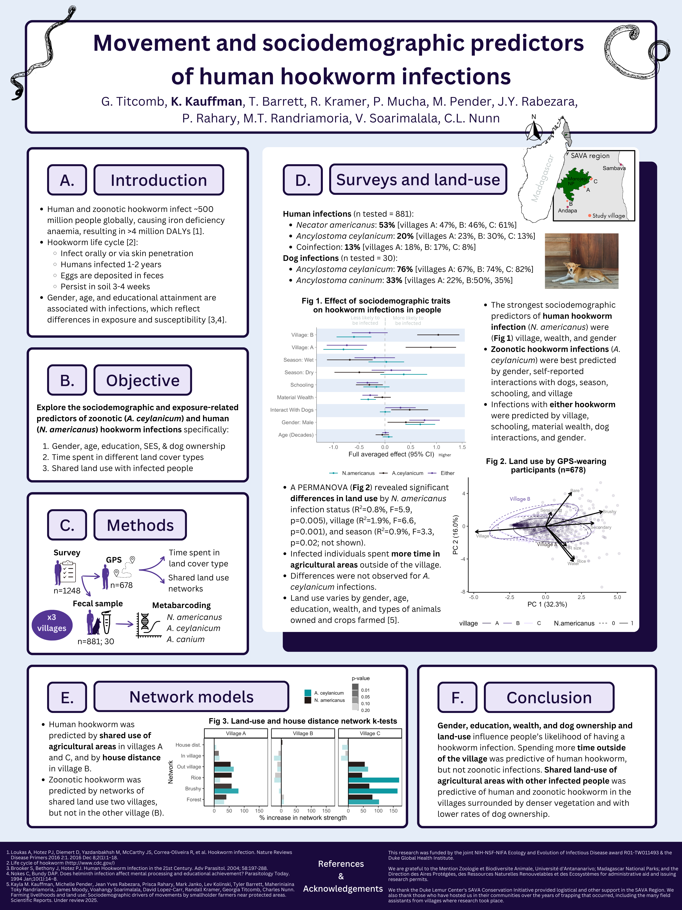

{fig-align="center"}

## Authors

Georgia Titcomb, Kayla Kauffman, Tyler Barrett, Randall Kramer, Peter Mucha, Michelle Pender, Jean Yves Rabezara, Prisca Rahary, M. Toky Randriamoria, Voahangy Soarimalala, Charles L. Nunn

## Abstract

Human hookworm infections affect half a billion people worldwide, and are most common among those experiencing poverty. Previous research has focused on the sociodemographic correlates of hookworm infection, but not the locations and habitats where people are exposed to these environmentally transmitted parasites. Additionally, recent molecular research has revealed that multiple hookworm species with either humans or dogs as their definitive hosts infect people. Using GPS data loggers, we compared how infection with human-specific (*Necator americanus*) and zoonotic (*Ancylostoma ceylanicum*) hookworms relate to people's sociodemographic variables, land use, and spatial co-occurrence with infected people and dogs. We found a high prevalence (52% of females and 69% of males; n = 881) of hookworm infection across three villages in northeastern Madagascar where our study was conducted. Necator americanus was the dominant hookworm species (53% prevalence), yet the zoonotic hookworm *A. ceylanicum* was also common (20% prevalence). Consistent with previous findings, *N. americanus* was more prevalent in males than females and individuals with less formal education. Secondary forest fragments, which provide favorable environmental conditions for hookworm survival, were "high risk" environments for exposure to *N. americanus* among people living in villages with more forest cover. However, in villages with less forest cover, a household transmission network better predicted infections. We did not find strong environmental predictors for infection with dog-transmitted *A. ceylanicum*. Instead, living in a village with greater dog ownership corresponded to a higher infection risk. Dog defecation patterns are more widespread in villages than human defecation patterns, and this difference may result in greater "homogeneity of risk" of the dog-transmitted hookworm. By jointly studying sociodemographic and movement-based predictors of hookworm infection, we provide more nuanced insights into the patterns and exposure risks for this archetypal disease -- insights only possible with an interdisciplinary approach to studying the ecology of infectious diseases.

## Key words

Hookworm, Transmission networks, environmental transmission, neglected tropical diseases, sociodemographic

