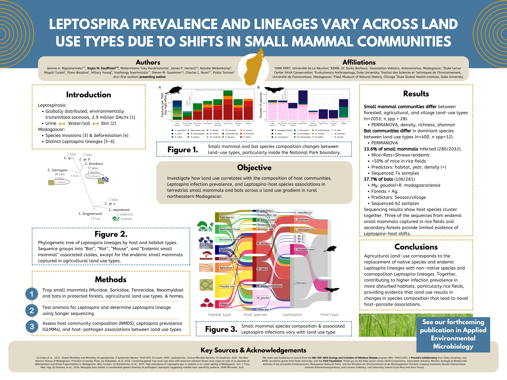

[View the article](https://journals.asm.org/doi/10.1128/aem.02061-25) and the [commentary by AEM](https://doi.org/10.1128/aem.00487-26)

{fig-align="center"}

## Authors

Jeanne A. Rajaonariveloa\*, Kayla M. Kauffmanb\*, Maheriniaina Toky Randriamoria, James P. Herrera, Natalie Wickenkamp, Magali Turpin, Fiona Baudino, Hillary Young, Voahangy Soarimalala, Steven M. Goodman, Charles L. Nunn, Pablo Tortosa \*co-first authors

## Abstract

Human-induced land-use change can affect the composition of small mammal communities and the ecology of their zoonotic pathogens — yet questions remain on the direction and generality of these changes, which can have opposite effects on disease prevalence depending on the ecological context and pathogen involved. These contrasting patterns highlight the need to investigate how specific host-pathogen assemblages respond to local anthropogenic land-use mosaics. To address this need, we studied terrestrial and bat species composition, Leptospira infection prevalence, and Leptospira species composition across a mosaic of land-use types in northeastern Madagascar. We found differences in host communities between forested, agricultural, and village land-use types for both bat (n = 400) and terrestrial (n = 2,053) small mammal communities. Leptospira infection prevalence was higher in bats (37.7%) than in terrestrial small mammals (13.8%), and bats were infected with Leptospira strains that were molecularly distinct from those shed by terrestrial small mammals. Non-native mice and rats were almost exclusively infected with cosmopolitan L. kirschneri and L. interrogans, respectively, while some native terrestrial small mammals sheltered L. mayottensis, and bats hosted a more diverse set of Leptospira species. Leptospira prevalence across land-use types varied in terrestrial small mammals, but not in bats. Altogether, the highest prevalence occurred in mice in flooded rice fields. Our data show that land use predominantly impacts Leptospira infecting terrestrial mammals, likely due to habitat disturbance favoring replacement of endemic hosts and pathogens with Muridae rodents and their associated pathogens, many of which are zoonotic.

## Key words

land cover change, emerging neglected tropical disease, invasive species, zoonosis, wildlife, One Health

