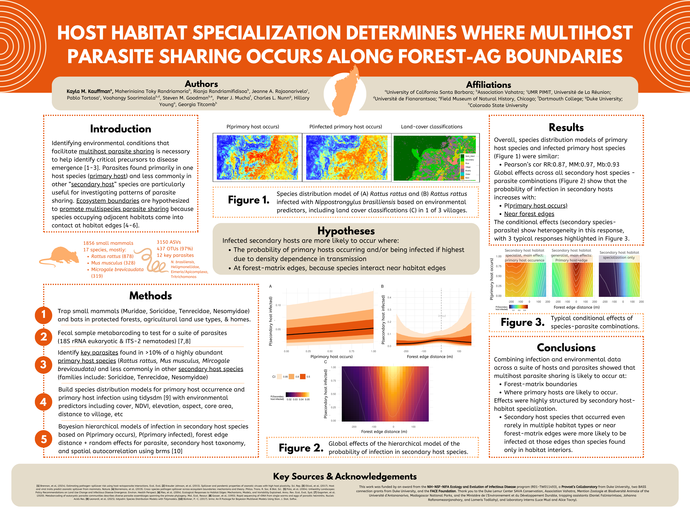

{fig-align="center"}

## Authors

Kayla M. Kauffman, Maheriniaina Toky Randriamoria, Rianja Randriamifidisoa, Jeanne A. Rajaonarivelo, Pablo Tortosa, Voahangy Soarimalala, Steven M. Goodman,  Peter J. Mucha, Charles L. Nunn, Hillary Young, Georgia Titcomb

## Abstract

Parasite sharing among wildlife species shapes biodiversity outcomes and offers broad insight into the mechanisms and geography of cross-species transmission. While spillover research often emphasizes zoonotic pathogens, transmission among wildlife hosts is widespread, tractable to study, and directly relevant to conservation. We combine parasite infection data with spatial analyses to test whether parasite sharing in a diverse community of endemic and invasive small mammals in Madagascar is associated with forest-agriculture boundaries. We define a “primary host” for each parasite as the host species in which the parasite is most frequently detected then all other infected host species as “secondary hosts”. We then predict where primary hosts and infected primary hosts are likely to occur using species distribution models, then evaluate where secondary hosts are likely to occur in regard to primary host occurrence and infection and distance to forst-agriculture boundaries. Guided by theory linking community assembly, contact structure, and transmission, we predict that spillover increases where primary and secondary hosts co-occur and is elevated at forest-agriculture boundaries where edge effects may increase interspecific contract rates and parasite diversity. Across host species and parasite taxa, we detect patterns consistent with edge-associated parasite sharing, but the relationship depends strongly on the level of secondary host habitat specialization. Thus revealing that multihost parasite sharing reflects interactions between landscape configuration and host ecological niches. These results indicate that habitat modification can restructure host overlap and parasite sharing, and that forecasting spillover requires combining edge effects with species-specific habitat associations. This framework can help identify permeable areas for cross-species transmission in wildlife communities and inform conservation planning and spillover risk assessment.

## Key words

Multihost parasites, Nematodes, environmental transmission, habitat boundaries, species distribution models

